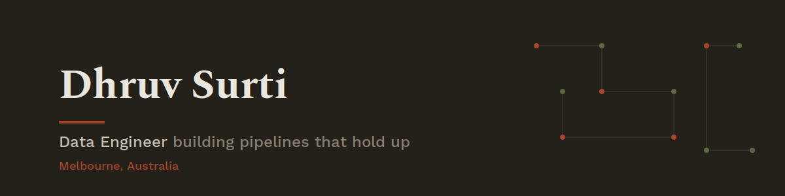

 

 

## About me

I'm a Computer Science (Data Science) graduate from Deakin University, currently working as an **AI & Data Administrator at Natural Velocity**. I build ETL pipelines that hold up under real conditions: automated tests, idempotent loading, and documentation that isn't an afterthought.

- 🔭 Building automated, tested data pipelines (Python + PostgreSQL + dbt)
- 📚 Studying for the **SnowPro Core** certification
- 🌱 Learning Apache Airflow and Azure
- 💬 Ask me about ETL design, dbt testing, or debugging messy real-world APIs
- 📫 **youhavereacheddhruv@gmail.com**

 

## Skills

 

## Featured Projects

<b>🩺 Clinical Trials ETL Pipeline</b>

 

Pulls live clinical trial data from the ClinicalTrials.gov REST API, cleans and flattens it, and loads it into PostgreSQL using idempotent upserts. Layered with dbt staging and mart models, automated data quality tests, and generated documentation.

**[View repository →](https://github.com/dhruv-surti/clinical-data-pipeline)**

 

<b>🎫 Instant Credential Portal</b>

 

Real-time credential distribution system built for a live NVIDIA-affiliated developer workshop (40+ attendees). Redesigned from a claim-based to a pre-assigned allocation model to eliminate race-condition risk entirely. Zero failed lookups, zero downtime on the day.

**[View repository →](https://github.com/dhruv-surti/NVIDIA-Brev-Code-Portal)**

 

<b>🐦 Domain Shift in Bushfire Tweet Classification (NLP Research Paper)</b>

 

Compared six model families for classifying actionable versus noise tweets during Australian bushfire emergencies. Proposed fine-tuned RoBERTa model beat every baseline, including a 1.3B-parameter LLM tested zero-shot (F1 0.886). Written in ACM sigconf format, graded High Distinction.

**[View repository →](https://github.com/dhruv-surti/bushfire-tweet-domain-shift-nlp)**

 

<b>⚡ Residential Energy Analytics & Margin Assurance</b>

 

Simulated energy consumption and revenue across 10,000 Australian households. A 3-phase pipeline: SQL data engineering → Excel financial modelling → Tableau executive dashboard, comparing pricing across EV, Solar, and Standard plans.

**[View repository →](https://github.com/dhruv-surti/Residential-Energy-Analytics-Margin-Assurance)**

 

<b>🛒 Coles Sales Performance Dashboard</b>

 

Interactive Power BI dashboard analysing store-level gross sales, revenue per staff, and forecast-vs-actual performance across six Australian states.

**[View repository →](https://github.com/dhruv-surti/coles-sales-dashboard)**

 

## GitHub Stats

 

## Trophies

 

Thanks for stopping by — always happy to talk data pipelines. 🦆

